1. # Журиков Егор, ИС 22/9-1
2. ## Описание базы данных
- База данных спроектирована для управления информацией о спортивных событиях. В ней содержатся следующие сущности (таблицы) и их атрибуты:
### Описание сущностей
#### Сущность "players"
1. **players**: хранит информацию о игроках
   - `id` (integer): уникальный идентификатор игрока
   - `name` (varchar): имя игрока
   - `birthdate` (date): дата рождения
   - `position` (varchar): позиция игрока в команде
   - `team_id` (integer): идентификатор команды


#### Сущность "сoaches"
2. **coaches**: содержит информацию о тренерах
   - `id` (integer): уникальный идентификатор тренера
   - `name` (varchar): имя тренера
   - `birthdate` (date): дата рождения
   - `team_id` (integer): идентификатор команды, в которой работает тренер


#### Сущность "teams"
3. **teams**: информация о командах
   - `id` (integer): уникальный идентификатор команды
   - `name` (varchar): название команды
   - `country` (varchar): страна команды

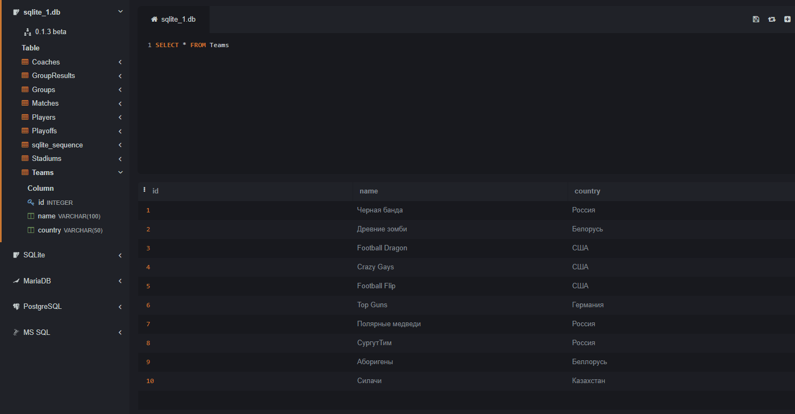

#### Сущность "matches"
4. **matches**: сведения о матчах
   - `id` (integer): уникальный идентификатор матча
   - `team_id` (integer): идентификатор команды
   - `match_date` (date): дата матча
   - `result` (varchar): результат матча


#### Сущность "groupresults"
5. **groupresults**: результаты в группах
   - `id` (integer): идентификатор
   - `group_id` (integer): идентификатор группы
   - `team_count` (integer): количество команд в группе
   - `total_matches` (integer): общее количество матчей
   - `wins` (integer): количество побед
   - `draws` (integer): количество ничьих
   - `losses` (integer): количество поражений
   - `goals_for` (integer): забитые голы
   - `goals_against` (integer): пропущенные голы

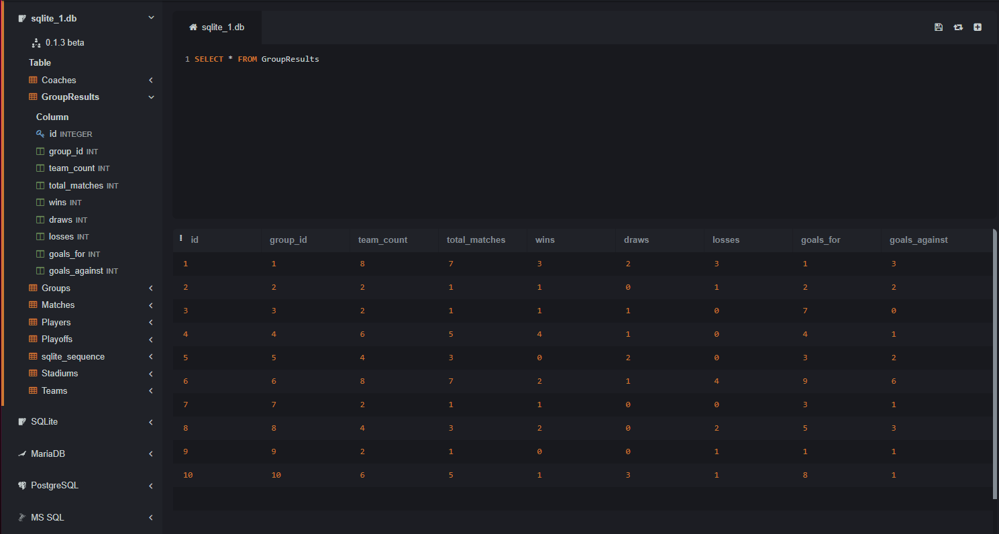

#### Сущность "playoffs"
6. **playoffs**: информация о плей-офф
   - `id` (integer): уникальный идентификатор
   - `team_id` (integer): идентификатор команды
   - `stadium_id` (integer): идентификатор стадиона
   - `result` (varchar): результат

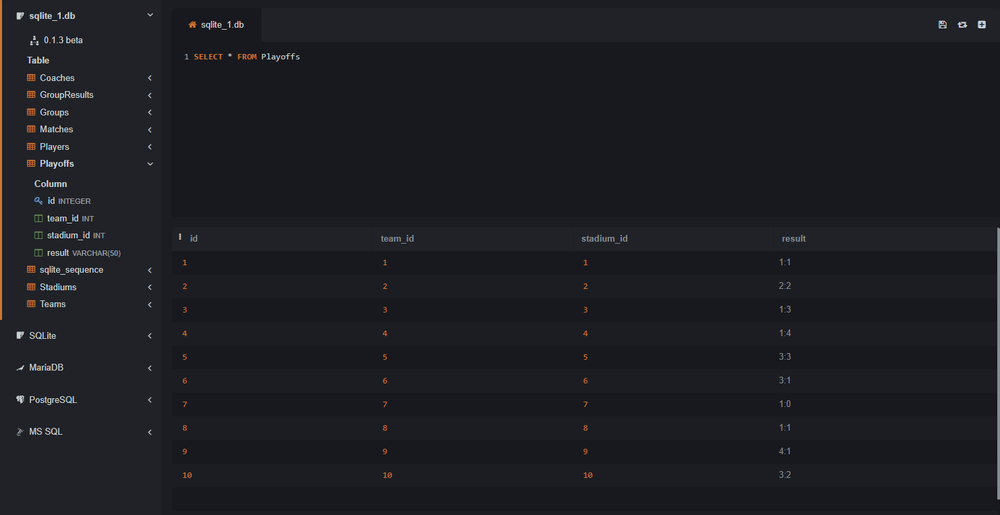

#### Сущность "groups"
7. **groups**: сведения о группах
   - `id` (integer): идентификатор группы
   - `name` (varchar): название группы


#### Сущность "stadiums"
8. **stadiums**: информация о стадионах
   - `id` (integer): идентификатор стадиона
   - `name` (varchar): название стадиона
   - `city` (varchar): город, где находится стадион
   - `capacity` (integer): вместимость стадиона

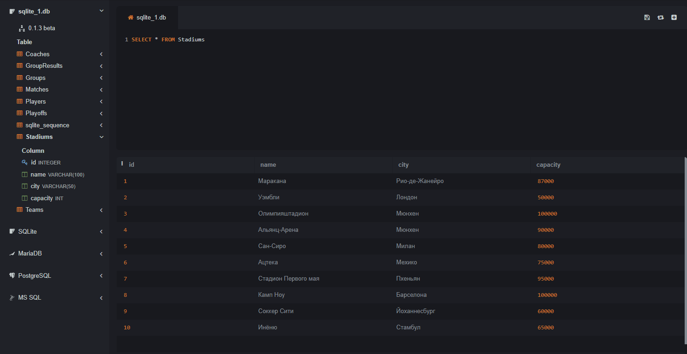   

## Демонстрация SQL-запросов
3. ## UNION
    ```sql
    SELECT name, 'Player' AS type, birthdate FROM players
    UNION
    SELECT name, 'Coach' AS type, birthdate FROM coaches;
    ```
    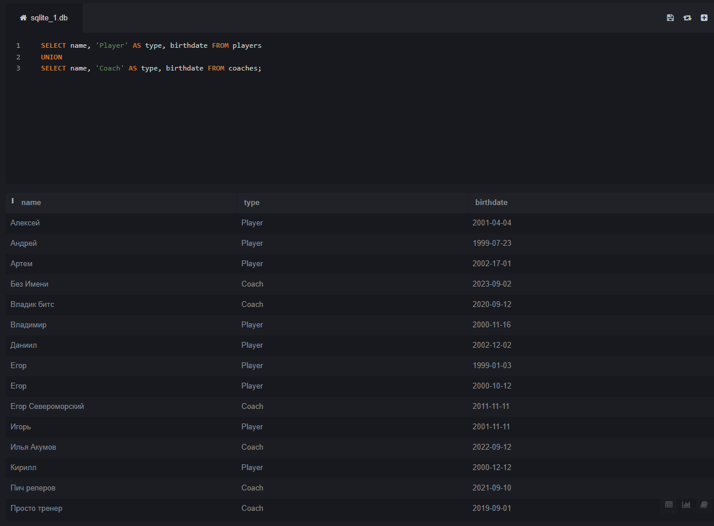 

    Этот запрос выводит список всех участников (игроков и тренеров), их роли (игрок или тренер) и даты рождения. Запрос не включает повторяющиеся строки.

4. ## ORDER BY
    ```sql
    SELECT name, birthdate FROM players
    ORDER BY birthdate DESC;
    ```

    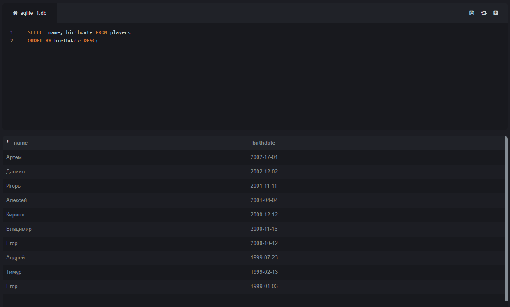 

    Этот запрос выводит имена и даты рождения игроков, упорядоченные по убыванию даты рождения, т.е. от самого молодого к самому старшему.

5. ## HAVING
    ```sql
    SELECT t.name, COUNT(p.id) AS player_count
    FROM teams t
    JOIN players p USING(id)
    GROUP BY t.name
    HAVING COUNT(p.id) > 0;
    ```

    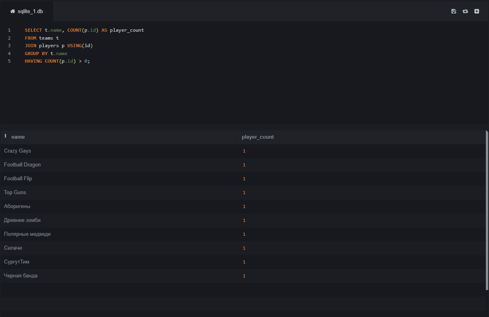 

    Этот запрос выводит названия команд и количество игроков в каждой команде, но только для тех команд, у которых более 0 игроков.

6. ## Вложенные Запросы
    ### В SELECT

    ```sql
    SELECT t.name, 
       (SELECT AVG(YEAR(NOW()) - YEAR(p.birthdate)) 
        FROM players p 
        WHERE p.team_id = t.id) AS avg_age
    FROM teams t;
    ```
     

    Этот запрос выводит название каждой команды и средний возраст игроков в этой команде.

    ### В WHERE
    ```sql
    SELECT t.name, COUNT(p.id) AS player_count
    FROM teams t
    JOIN players p ON t.id = p.team_id
    GROUP BY t.name
    HAVING COUNT(p.id) > (SELECT AVG(player_count) FROM (SELECT COUNT(id) AS player_count FROM players GROUP BY team_id) AS avg_count);
    ```
     

    Этот запрос выводит названия команд и количество игроков в каждой команде, но только для тех команд, у которых количество игроков превышает среднее значение по всем командам.
7. ## Оконные функции
    ## Агрегатные функции
    ```sql
    SELECT name,
        COUNT(*) OVER (PARTITION BY id) AS player_count
    FROM players;
    ```

    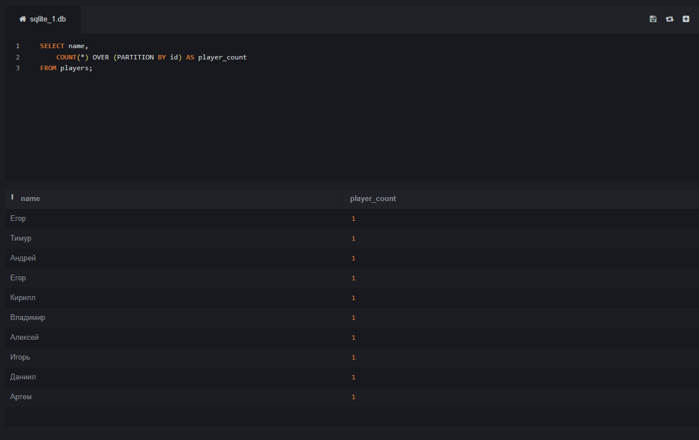 

    Этот запрос выводит название каждой команды и общее количество игроков в этой команде. 
    ## Ранжирующие функции
    ```sql
    SELECT name,
        birthdate,
        RANK() OVER (PARTITION BY id ORDER BY birthdate) AS age_rank
    FROM players;
    ```

     

    Этот запрос выводит имя и дату рождения каждого игрока, а также их ранг внутри команды по возрасту.
    ## Функции смещения
    ```sql
    SELECT match_date,
        team_id,
        result,
        LAG(result) OVER (PARTITION BY id ORDER BY match_date) AS prev_goals,
        LEAD(result) OVER (PARTITION BY id ORDER BY match_date) AS next_goals
    FROM matches;
    ```
     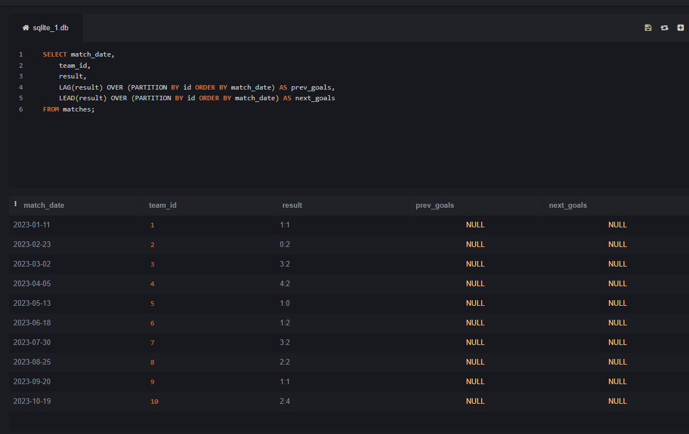 

Этот запрос выводит дату матча, идентификатор команды, количество забитых голов в текущем матче, а также предыдущее и следующее количество забитых голов командой в хронологическом порядке.

8. ## JOINs

    ## Inner Join

    ```sql
    SELECT teams.name AS team_name, players.name AS player_name
    FROM teams
    INNER JOIN players ON teams.id = players.id;
    ```
     

    Этот запрос выводит название команды и имя игрока для всех пар, где есть соответствующая запись в обеих таблицах.

    ## Left Join

    ```sql
    SELECT teams.name AS team_name, players.name AS player_name
    FROM teams
    LEFT JOIN players ON teams.id = players.id;
    ```
    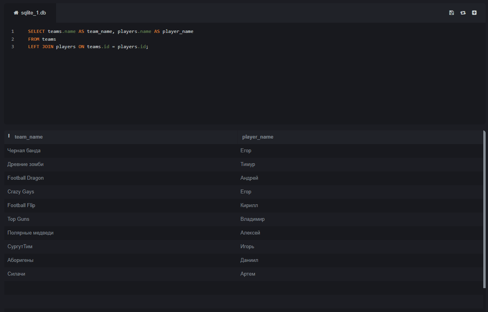 

    Этот запрос выводит название команды и имя игрока для всех записей из таблицы команд, а также соответствующие записи из таблицы игроков, если они есть.

    ## Right Join

    ```sql
    SELECT teams.name AS team_name, players.name AS player_name
    FROM teams
    RIGHT JOIN players ON teams.id = players.id;
    ```
    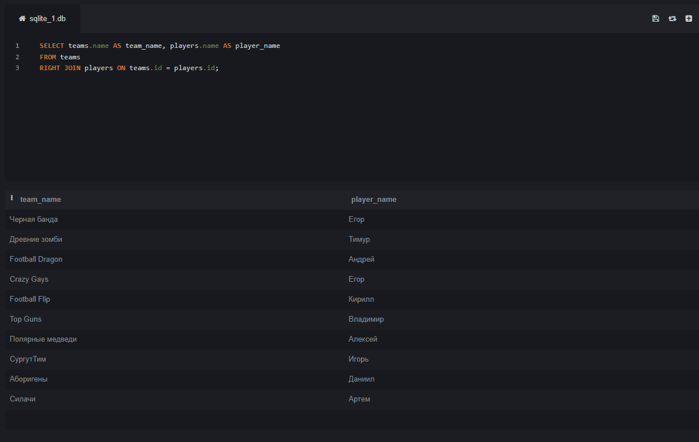 

    Этот запрос выводит название команды и имя игрока для всех записей из таблицы игроков, а также соответствующие записи из таблицы команд, если они есть.

    ## Cross Join

    ```sql
    SELECT teams.name AS team_name, players.name AS player_name
    FROM teams
    CROSS JOIN players
    ORDER BY Teams.name ASC 
    ```
    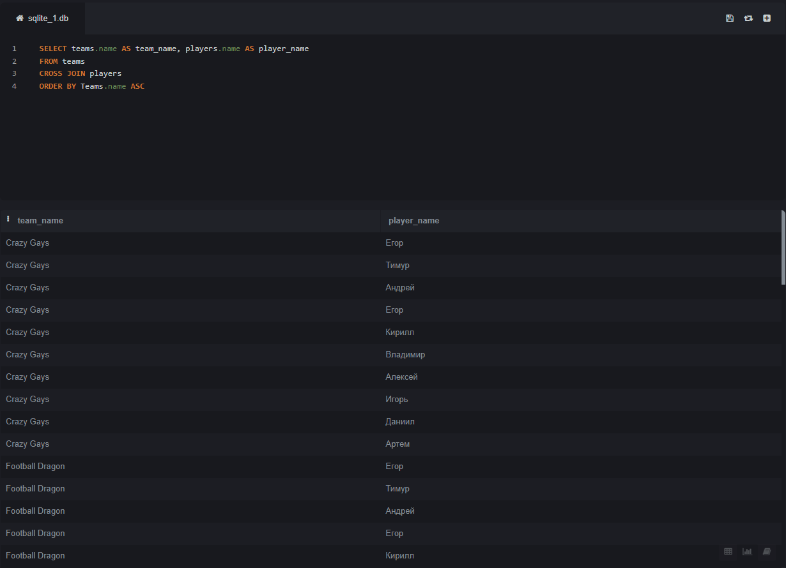 

    Этот запрос выводит все возможные комбинации названий команд и имен игроков из обеих таблиц.

    ## Full Outer Join

    ```sql
    SELECT teams.name AS team_name, players.name AS player_name
    FROM teams
    FULL OUTER JOIN players ON teams.id = players.team_id;
    ```
    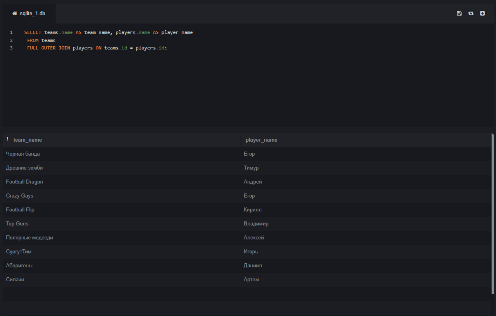 

    Этот запрос выводит название команды и имя игрока для всех записей из обеих таблиц. Если соответствующая запись отсутствует в одной из таблиц, то соответствующее поле будет содержать NULL.


9. ## CASE

    ### Оператор CASE

    ```sql
    SELECT name,
        CASE 
            WHEN position = 'Вратарь' THEN CONCAT('GK: ' , name)
            WHEN position = 'Защитник' THEN CONCAT('DF: ', name)
            WHEN position = 'Полузащитник' THEN CONCAT('MF: ', name)
            WHEN position = 'Форвард' THEN CONCAT('FW: ', name)
            ELSE name
        END AS formatted_name
    FROM players;
    ```
     

    Этот запрос выводит имя игрока, но в зависимости от его позиции добавляет префикс для форматирования. Например, для вратаря добавляется префикс "GK:", для защитника - "DF:", для полузащитника - "MF:", а для нападающего - "FW:".
10. ## WITH
    ### Ключевое слово WITH

    ```sql
    WITH team_players AS (
        SELECT teams.name AS team_name, players.name AS player_name
        FROM teams
        JOIN players ON teams.id = players.id
    )
    SELECT * FROM team_players;
    ```
    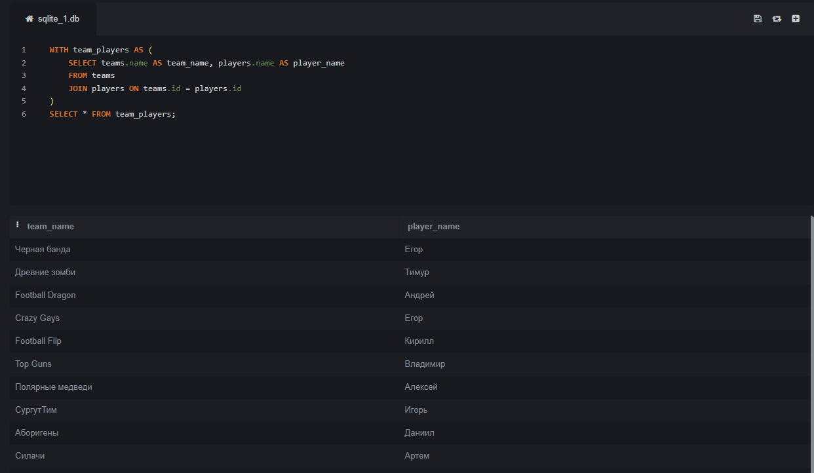
    Этот запрос создает временную таблицу `team_players`, которая содержит название команды и имя игрока, а затем выводит все записи из этой временной таблицы.
